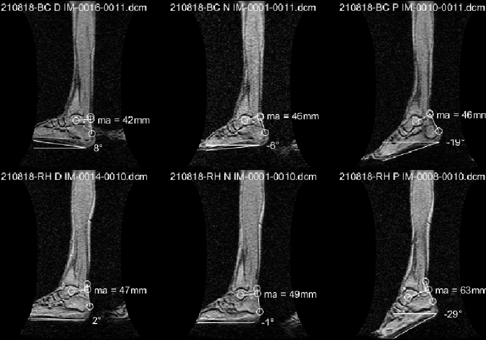
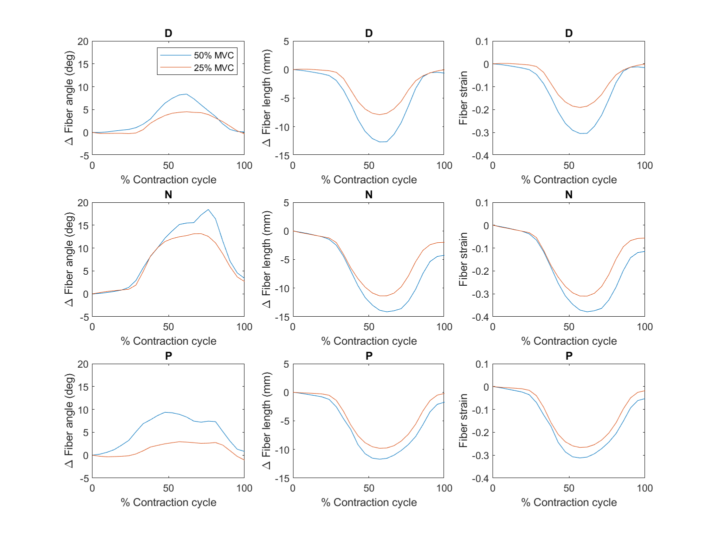
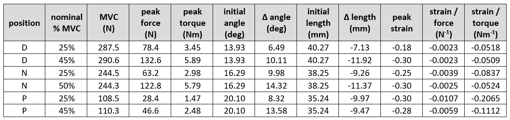

[Home](https://bcunnane.github.io/) • [Code](https://github.com/bcunnane/fiber_tracking)

This experiment studies muscle fiber strains in the medial gastrocnemius (MG) of the human calf at different ankle angles and exertion levels to identify the dependence of muscle force on muscle architecture.

### Collect Data
Data was collected for 6 subjects in a 1.5T MRI scanner as shown in Figure 1. The subject’s foot is positioned in a foot pedal fixture that records their pressing force. A projector prompts them to repeatedly press the pedal at a certain percentage of their maximum voluntary contraction (% MVC). This procedure is repeated for high (50% MVC) and low (25% MVC) pressing forces at three foot positions: dorsiflexion, neutral, and plantar flexion. Several different MRI sequences were utilzed to collect different image types, including:
1. Large field of view images to measure the subject's ankle position (see Figure 2)
2. Multiple slices of high resolution images to scout for an ideal slice with clear fibers
3. Diffusion images for the chosen slice
4. Dynamic (i.e. video) velocity images for the chosen slice

![Experimental Setup]
> *Figure 1. Experimental Setup

![Ankle Angles]
> *Figure 2. Ankle angle measurements for all subjects

### Identify Muscle Fibers from Diffusion Tensors
Diffusion tensors are calculated from the diffusion images. Since the primary direction of water diffusion within skeletal muscle is along the muscle fiber, the diffusion tensor's principal eigenvector follows the muscle fiber's direction. An outline of the MG muscle was manually identified, then split into three equal-size regions: proximal, middle, and distal. Then the principal eigenvectors in each region were extracted and averaged to form representative fibers (see Figure 3).

![DTI image]
> * DTI image

### Track Muscle Fibers and Analyze Changes
The endpoints of the DTI-identified muscle fibers were tracked through each frame of the dynamic study (See Figure 4). Changes in fiber angle were calculated with respect to the vertical in the image. Changes in fiber length were calculated with respect to initial length, leading to changes in Lagrangian strain. The results of the three muscle fibers were averaged together (see Figure 5). 

![Fiber Gif]
> *Figure 4. *Figure 2. Average muscle fibers identified from diffusion tensor data for the proximal, middle, and distal regions of the MG muscle. Cine image shows change in fiber length and angle over contraction cycle for all exertion levels and ankle angles of a single subject.

![Result Plot]
> *Figure 5. Change in fiber angle, length, and strain vs temporal cycle for the three foot positions. Determined from tracking change in position of the DTI-identified fibers throughout the muscle contraction cycle. The results for the fibers in the proximal, middle, and distal regions of the MG muscle were averaged for each percent MVC.*

### Statistical Analysis and Results
Table 1 shows the averages and standard deviations (in brackets) of the results across all subject. Significant differences in outcomes for the particular foot angles and submaximal force levels were assessed using two-way analysis of variance (ANOVA) and paired t-testing.

![Table]
> *Table 1. Averaged and standard deviation (in brackets) MG muscle fiber tracking results for all subjects at high and low percentages of MVC for the three foot positions.

## Muscle fiber strain determined from motion tracking

The muscle fiber endpoints determined in 1a are used in an experiment that analyzes MG muscle strain at different foot positions using 2D dynamic MRI. The subject’s foot is positioned in a foot pedal fixture in the bore of a 1.5T scanner. A projector prompts them to repeatedly press the pedal at different levels of their maximum voluntary contraction (% MVC) while a velocity encoded phase contrast (VEPC) sequence collects dynamic MR data of their calf. This procedure is repeated for high and low pressing forces at three foot positions: dorsiflexion, neutral, and plantar flexion (Figure 1). 

> *Figure 1. Large FOV sagittal images of two subjects (top vs bottom row) at foot positions D, N, and P from left to right. The foot angles were measured from horizontal, and the moment arms (ma) were measured from the ankle joint to the Achilles tendon.*

I assisted in data collection and wrote a MATLAB script to organize fiber tracking (via velocities changing position through each frame); calculations of fiber length, strain, and angle; and data visualization (Figures 2, 3, & 4). This effort utilized equipment and code (for image processing and fiber motion tracking) from my research group’s past projects (see references), requiring me to adapt old tools for new applications. This experiment demonstrated relationships between foot position and strain, which could reveal physiological relationships between fiber length or angle and overall force generation.

> *Figure 2. Average muscle fibers (yellow) identified from DTI data for the proximal, middle, and distal regions of the MG muscle. Cine image shows change in fiber length and angle over contraction cycle for a subject in the dorsiflexed foot position.*

> *Figure 3. Change in fiber angle, length, and strain vs temporal cycle for the three foot positions. Determined from tracking change in position of the DTI-identified fibers throughout the muscle contraction cycle. The results for the fibers in the proximal, middle, and distal regions of the MG muscle were averaged for each percent MVC.*

> *Table 1. Averaged MG muscle fiber tracking results for all subjects at high and low percentages of MVC for the three foot positions.*
