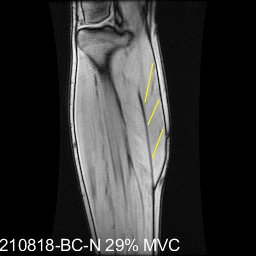
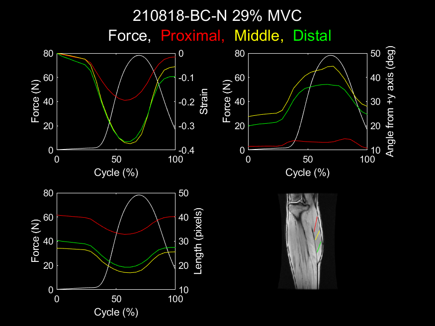

[Home](https://bcunnane.github.io/)  
[View Code](https://github.com/bcunnane/fiber_tracking)

## Muscle fiber strain determined from motion tracking

Muscle fiber strain represents deformation from stress and is therefore related to the overall force exerted by the muscle. Analyzing muscle fiber strain in young and old patients can reveal differences in deformation for the same amount of relative force. This experiment studies the muscle fiber strain for young and old patients at different foot positions. This project is an extension of prior work by Malis (see refernce section below) and utilized its hardware (foot pedal fixture, data acquisition) and software (DICOM processing, VEPC motion tracking).

### 1. Data collection

Data is collected in a 1.5T GE scanner at UC San Diego's Radiology Imaging Laboratory. The patient's dominant leg is positioned on the scanner bed in a foot pedal fixture. The subject is first scanned with a fast spin echo sequence to provide high resolution images of their leg. From these, an optimal slice is chosen for the dynamic imaging. Next, the subjects maximum pressing force is determined. The foot pedal fixture records their maximum pressing force, and the average of 3 trials is set as their maximum voluntary contraction (MVC). The subject is then prompted via projector to repeatedly press their foot with a high or low percentage of MVC, and the dynamic imaging sequence collects velocity encoded phase contrast (VEPC) images of the subjects leg during foot presses. Each press acts as a trigger that is sent to the scanner via the ECG system. This process is repeated for 3 foot positions: dorsiflexion, neutral, and plantar flexion.

> *Dorsiflex, neutral, and plantar flex foot positions.*

### 2. Data processing & strain analysis

I wrote a script to organize data processing so that the collected data is automatically saved as MATLAB structures. 

The fiber endpoints are identified on the first image frame (this may be done manually or by DTI eigenvector analysis). These endpoints are then progressively tracked through each frame using the VEPC veloctiy data. Once the endpoint locations are known, fiber elongation and therefore fiber strain may be calculated for each frame. I also wrote MATLAB functions to automatically create animations of fiber motion and plot strain over the cycle. The examples below show the results for neutral (N) foot position at 29% MVC for a subject.

> *Proximal, middle, and distal muscle fiber motion across all image frames*

> *Plots of proximal, middle, and distal muscle fiber strain, length, and angle compared to measured force.*

## References
Malis, V. (2020). Study of Human Muscle Structure and Function with Velocity Encoded Phase Contrast and Diffusion Tensor Magnetic Resonance Imaging Techniques. UC San Diego. ProQuest ID: Malis_ucsd_0033D_19166. Merritt ID: ark:/13030/m5tn2jhg. Retrieved from https://escholarship.org/uc/item/9x42v0wq
